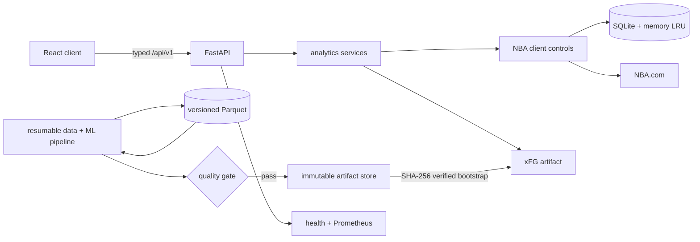

# NBA Stat Analyzer

A production-oriented NBA analytics platform with a FastAPI service, strict
TypeScript/React client, resilient NBA.com integration, and a leakage-resistant
shot-quality ML pipeline.

The project is deliberately broader than a dashboard: it demonstrates a
versioned API with typed parameters and errors, strict frontend domain types,
deterministic testing, cache/concurrency controls, model governance, data
lineage, observability, container delivery, and accessible product UX.

## Highlights

- Eight player-analysis views, game investigations, comparisons, league
  leaders, interactive shot charts, and an optional tool-grounded Gemini mode.
- Versioned `/api/v1` FastAPI contract with RFC 7807-style errors, input
  validation, request IDs, freshness headers, rate limits, Prometheus metrics,
  health probes, retries, stale-if-error, single-flight, and circuit breaking.
- Resumable team-season ingestion into verified raw Parquet partitions,
  validated Hive-partitioned datasets, immutable manifests, read-only DuckDB
  queries, and verified local/S3-compatible artifacts.
- xFG v3 training code with date-grouped temporal folds, separate tuning and
  calibration periods, out-of-fold empirical-Bayes priors, clustered bootstrap
  intervals, calibration/drift/slice reports, and an atomic promotion gate.
- Strict TypeScript, generated OpenAPI surface checks, TanStack Query async states,
  accessible search/filter controls, lazy routes/tabs, and deterministic Vitest
  coverage.
- Pinned Python/Node dependencies, CI, scheduled retraining, GHCR publishing,
  multi-stage non-root Docker image, Compose, and a Render Blueprint.

> Current artifact status: the local ignored artifact is xFG **v2** (657,387
> shots; held-out Brier 0.2244, AUC 0.662). The v3 pipeline is implemented and
> gated, but a v3 artifact is intentionally not claimed as deployed until a
> fresh ID-complete ingestion passes the recorded promotion rules.

## Run it

Prerequisites: Python 3.12, [uv](https://docs.astral.sh/uv/), Node.js 24, and
npm. Internet is needed for dependency installation and uncached NBA requests;
the default test suites are offline.

On Windows, the shortest setup is:

```powershell
.\setup.ps1
.\start-app.bat
```

The equivalent manual setup is:

```powershell
git clone <your-repository-url>
Set-Location NBA-Stat-Analyzer

Set-Location backend
uv sync --locked --extra dev
Set-Location ..\frontend
npm ci
npm run build
Set-Location ..

backend\.venv\Scripts\python.exe -m uvicorn app.main:app --app-dir backend --port 8000
```

Open <http://localhost:8000>. API docs are at <http://localhost:8000/docs>.
The app still works without Gemini; copy `backend/.env.example` to
`backend/.env` only when you need configuration overrides.

For hot reload, run these in separate terminals:

```powershell
backend\.venv\Scripts\python.exe -m uvicorn app.main:app --app-dir backend --reload --port 8000
```

```powershell
Set-Location frontend
npm run dev
```

### Docker

```powershell
docker compose up --build
```

The image is multi-stage, runs as a non-root user, exposes a health check, and
does not bake the ignored model, cache, dataset, or secrets into an image.
Configure verified model bootstrap for production as described in
[`docs/DEPLOYMENT.md`](docs/DEPLOYMENT.md).

## Data and ML workflow

Run from `backend`:

```powershell
# Resume three seasons of team-level ingestion and combine the partitions.
uv run nba-pipeline ingest --recent-seasons 3 --combined data/staging/shots.parquet

# Validate, version, and atomically build the processed dataset.
uv run nba-pipeline build data/staging/shots.parquet

# Train a candidate. This saves evidence even when the gate fails.
uv run nba-pipeline train data/processed/shots `
  --dataset-version <version-from-data/manifests/shots.json>

# Inspect the report, then promote only a passing, checksum-pinned candidate.
uv run nba-pipeline evaluate data/models/xfg-v3-candidate.joblib
uv run nba-pipeline promote data/models/xfg-v3-candidate.joblib `
  --sha256 <candidate-sha256>
```

The checked-in `shots_export.csv` is a legacy human-readable v2 export. It does
not contain the complete event identifiers required by the v3 data contract;
run the resumable ingestion for a v3 candidate.

Useful pipeline commands:

```powershell
uv run nba-pipeline --help
uv run nba-pipeline validate <shots.csv-or-parquet>
uv run nba-pipeline verify <source> <manifest.json>
uv run nba-pipeline query data/processed/shots "SELECT SEASON, count(*) FROM shots GROUP BY 1"
uv run nba-pipeline cache-prune-pipeline          # preview obsolete payloads
uv run nba-pipeline cache-prune-pipeline --apply --vacuum
```

NBA statistics remain subject to NBA.com availability and terms. See the
[`data card`](docs/DATA_CARD.md) before redistributing derived data.

## Verify it

```powershell
Set-Location backend
uv run ruff check app scripts tests load
uv run mypy app
uv run pytest --cov=app --cov-report=term-missing
uv run python scripts/export_openapi.py

Set-Location ..\frontend
npm run generate:api
npm run lint -- --deny-warnings
npm test
npm run build
```

Or run the repository skill:

```powershell
powershell -ExecutionPolicy Bypass -File .agents\skills\nba-release-readiness\scripts\verify.ps1 -Container
```

The Locust workload is opt-in because it targets a running service:

```powershell
Set-Location backend
uv sync --locked --extra load
uv run locust -f load/locustfile.py --host http://localhost:8000
```

## Architecture



See [`docs/ARCHITECTURE.md`](docs/ARCHITECTURE.md) for request, data, model, and
deployment boundaries.

## Project agents and skills

The repo contains local Codex configuration so repeated engineering work uses
the same standards:

- Agents: code mapping, API review, ML evaluation, performance profiling,
  frontend quality, security review, release verification, and portfolio review
  in `.codex/agents/`.
- Skills: pipeline changes, xFG evaluation, cross-layer feature delivery,
  release readiness, performance budgets, security audits, UI quality, and
  portfolio evidence in `.agents/skills/`.
- Instructions: root and directory-specific `AGENTS.md` files.

Example requests: “Use `ml_evaluator` to review this candidate report,” “run
`$nba-security-audit`,” or “use `$nba-feature-delivery` to add a filter across
the API and UI.” These helpers review and automate work; the normal release gate
remains authoritative.

## Documentation

- [`Architecture`](docs/ARCHITECTURE.md)
- [`Model card`](docs/MODEL_CARD.md)
- [`Data card`](docs/DATA_CARD.md)
- [`Deployment and operations`](docs/DEPLOYMENT.md)
- [`Threat model`](docs/THREAT_MODEL.md)
- [`Performance evidence`](docs/PERFORMANCE.md)
- [`Portfolio and interview guide`](docs/PORTFOLIO.md)
- [`User guide`](docs/USER_GUIDE.md) and [`troubleshooting`](docs/TROUBLESHOOTING.md)

MIT licensed. This project is not affiliated with or endorsed by the NBA.
