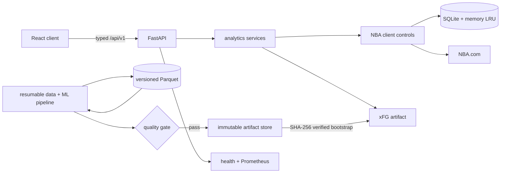

# NBA Stat Analyzer

A production-oriented NBA analytics platform with a FastAPI service, strict
TypeScript/React client, resilient NBA.com integration, and a leakage-resistant
shot-quality ML pipeline.

The project is deliberately broader than a dashboard: it demonstrates a
versioned API with typed parameters and errors, strict frontend domain types,
deterministic testing, cache/concurrency controls, model governance, data
lineage, observability, container delivery, and accessible product UX.

## Highlights

- Eight player-analysis views, game investigations, comparisons, league
  leaders, interactive shot charts, and an optional tool-grounded Gemini mode.
- Versioned `/api/v1` FastAPI contract with RFC 7807-style errors, input
  validation, request IDs, freshness headers, rate limits, Prometheus metrics,
  health probes, retries, stale-if-error, single-flight, and circuit breaking.
- Resumable team-season ingestion into verified raw Parquet partitions,
  validated Hive-partitioned datasets, immutable manifests, read-only DuckDB
  queries, and verified local/S3-compatible artifacts.
- xFG v3 training code with date-grouped temporal folds, separate tuning and
  calibration periods, out-of-fold empirical-Bayes priors, clustered bootstrap
  intervals, calibration/drift/slice reports, file-backed MLflow tracking with a
  gated model registry, and an atomic promotion gate.
- Explicit, discriminated-union API DTOs for the model surface with strict
  TypeScript client types derived directly from the generated OpenAPI, plus a
  SHAP shot-difficulty explainer endpoint and UI panel.
- Strict TypeScript, generated OpenAPI surface checks, TanStack Query async states,
  accessible search/filter controls, lazy routes/tabs, and deterministic Vitest
  coverage.
- Pinned Python/Node dependencies, CI, scheduled retraining, GHCR publishing,
  multi-stage non-root Docker image, Compose, and a Render Blueprint.

> Current artifact status: the deployed artifact is xFG **v2** (657,387 shots;
> held-out Brier 0.2244, AUC 0.662). A v3 candidate was trained on a fresh 700k
> regular-season + playoffs dataset (`shots-v1-426fd715aa4e`) and evaluated
> against the recorded gate; it did **not** beat v2 and was **not** promoted, so
> v2 remains deployed. See [`docs/MODEL_CARD.md`](docs/MODEL_CARD.md) and
> [`docs/PROGRESS.md`](docs/PROGRESS.md).

## Run it

Prerequisites: Python 3.12, [uv](https://docs.astral.sh/uv/), Node.js 24, and
npm. Internet is needed for dependency installation and uncached NBA requests;
the default test suites are offline.

On Windows, the shortest setup is:

```powershell
.\setup.ps1
.\start-app.bat
```

The equivalent manual setup is:

```powershell
git clone <your-repository-url>
Set-Location NBA-Stat-Analyzer

Set-Location backend
uv sync --locked --extra dev
Set-Location ..\frontend
npm ci
npm run build
Set-Location ..

backend\.venv\Scripts\python.exe -m uvicorn app.main:app --app-dir backend --port 8000
```

Open <http://localhost:8000>. API docs are at <http://localhost:8000/docs>.
The app still works without Gemini; copy `backend/.env.example` to
`backend/.env` only when you need configuration overrides.

For hot reload, run these in separate terminals:

```powershell
backend\.venv\Scripts\python.exe -m uvicorn app.main:app --app-dir backend --reload --port 8000
```

```powershell
Set-Location frontend
npm run dev
```

### Docker

```powershell
docker compose up --build
```

The image is multi-stage, runs as a non-root user, exposes a health check, and
does not bake the ignored model, cache, dataset, or secrets into an image.
Configure verified model bootstrap for production as described in
[`docs/DEPLOYMENT.md`](docs/DEPLOYMENT.md).

## Data and ML workflow

Run from `backend`:

```powershell
# Resume three seasons of team-level ingestion and combine the partitions.
uv run nba-pipeline ingest --recent-seasons 3 --combined data/staging/shots.parquet

# Validate, version, and atomically build the processed dataset.
uv run nba-pipeline build data/staging/shots.parquet

# Train a candidate. This saves evidence even when the gate fails.
uv run nba-pipeline train data/processed/shots `
  --dataset-version <version-from-data/manifests/shots.json>

# Inspect the report, then promote only a passing, checksum-pinned candidate.
uv run nba-pipeline evaluate data/models/xfg-v3-candidate.joblib
uv run nba-pipeline promote data/models/xfg-v3-candidate.joblib `
  --sha256 <candidate-sha256>
```

The checked-in `shots_export.csv` is a legacy human-readable v2 export. It does
not contain the complete event identifiers required by the v3 data contract;
run the resumable ingestion for a v3 candidate.

Useful pipeline commands:

```powershell
uv run nba-pipeline --help
uv run nba-pipeline validate <shots.csv-or-parquet>
uv run nba-pipeline verify <source> <manifest.json>
uv run nba-pipeline query data/processed/shots "SELECT SEASON, count(*) FROM shots GROUP BY 1"
uv run nba-pipeline cache-prune-pipeline          # preview obsolete payloads
uv run nba-pipeline cache-prune-pipeline --apply --vacuum
```

NBA statistics remain subject to NBA.com availability and terms. See the
[`data card`](docs/DATA_CARD.md) before redistributing derived data.

## Verify it

```powershell
Set-Location backend
uv run ruff check app scripts tests load
uv run mypy app
uv run pytest --cov=app --cov-report=term-missing
uv run python scripts/export_openapi.py

Set-Location ..\frontend
npm run generate:api
npm run lint -- --deny-warnings
npm test
npm run build
```

The Locust workload is opt-in because it targets a running service:

```powershell
Set-Location backend
uv sync --locked --extra load
uv run locust -f load/locustfile.py --host http://localhost:8000
```

## Architecture


```mermaid
flowchart LR
  Browser[React client] -->|typed /api/v1| API[FastAPI]
  API --> Services[analytics services]
  Services --> Client[NBA client controls]
  Client --> Cache[(SQLite + memory LRU)]
  Client --> NBA[NBA.com]
  Services --> Model[xFG artifact]
  Pipeline[resumable data + ML pipeline] --> Parquet[(versioned Parquet)]
  Parquet --> Pipeline
  Pipeline --> Gate{quality gate}
  Gate -->|pass| Store[immutable artifact store]
  Store -->|SHA-256 verified bootstrap| Model
  API --> Metrics[health + Prometheus]
```

See [`docs/ARCHITECTURE.md`](docs/ARCHITECTURE.md) for request, data, model, and
deployment boundaries.

Current-season statistics are cached for up to 12 hours. The scheduled shot-data
and model pipeline runs separately; its weekly schedule does not change the
statistics refresh interval.

## Project agents and skills

The repo ships a set of **task-focused agents** in `.kiro/agents/` — each owns
one precise task (not a broad role), with least-privilege tools and scoped write
paths:

- `nba-data-scraper` — resumable NBA.com ingestion into verified Parquet.
- `web-researcher` — one scoped, cited external lookup (read-only).
- `bug-efficiency-validator` — read-only defect and efficiency review.
- `api-contract-verifier` — keep OpenAPI and the TS client types in sync.
- `ml-model-evaluator` — leakage/calibration/gate review of an xFG candidate.
- `live-ui-auditor` — drive the running app, verify the four journeys work.
- `ui-design-validator` — visual-design critique vs Material Design.
- `feature-test-author` — offline tests for one feature or bug.
- `docs-progress-tracker` — keep progress docs current.

The workflow that coordinates them — when to use which, the review DAG, and the
verification gate — is the `.kiro/skills/nba-agent-workflow` skill. Root and
directory-specific `AGENTS.md` files carry the engineering standards and code
review rules. Local code and offline tests remain the source of truth.

Reviewers run after edits settle and in parallel where independent; the primary
agent integrates contracts and runs the release gate before handoff.

## Use it from your AI assistant (MCP)

A local, read-only [MCP](https://modelcontextprotocol.io) server, `nba_stats`,
lets an external AI client (Claude Desktop, Kiro, Cursor) call this project's NBA
tools — player lookup, comparisons, shot profiles, league leaders, game
investigations, and the xFG shot-quality estimate — grounded in live NBA data.
It wraps the same backend logic the app uses, so it inherits the cache, rate
limits, and validation.

```powershell
powershell -ExecutionPolicy Bypass -File backend\mcp_servers\setup.ps1
```

The setup prints a ready-to-paste client config for your machine. The in-app
Gemini Ask AI feature is separate and does not go through MCP. See
[`backend/mcp_servers/README.md`](backend/mcp_servers/README.md) for the full
guide and tool list.

## Documentation

- [`Architecture`](docs/ARCHITECTURE.md)
- [`Progress log`](docs/PROGRESS.md)
- [`Shot-context research (#2)`](docs/RESEARCH_SHOT_CONTEXT.md)
- [`MCP server`](backend/mcp_servers/README.md)
- [`Model card`](docs/MODEL_CARD.md)
- [`Data card`](docs/DATA_CARD.md)
- [`Deployment and operations`](docs/DEPLOYMENT.md)
- [`Threat model`](docs/THREAT_MODEL.md)
- [`Performance evidence`](docs/PERFORMANCE.md)
- [`Portfolio and interview guide`](docs/PORTFOLIO.md)
- [`User guide`](docs/USER_GUIDE.md) and [`troubleshooting`](docs/TROUBLESHOOTING.md)

MIT licensed. This project is not affiliated with or endorsed by the NBA.
