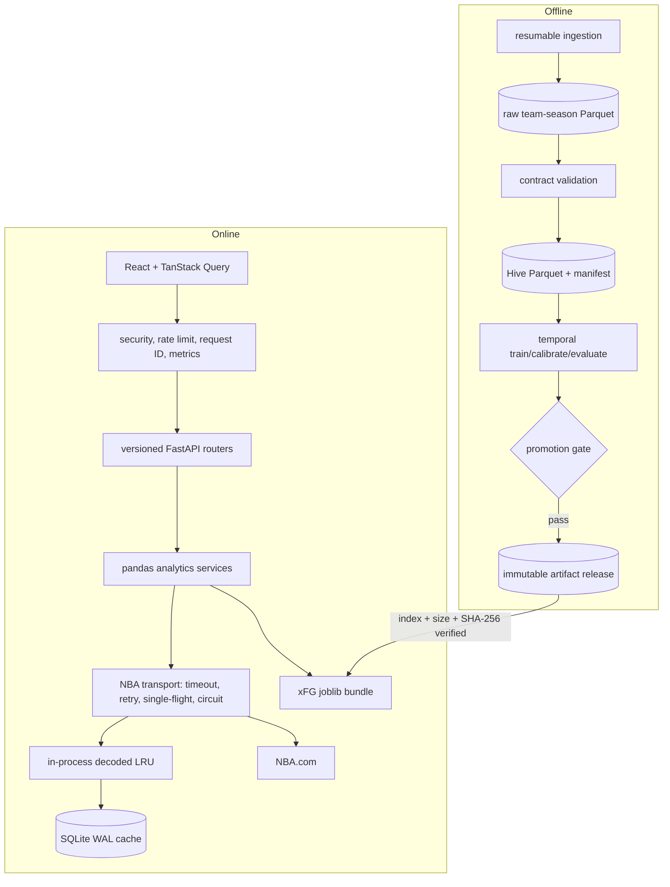

# Architecture

## System boundary

NBA Stat Analyzer is a modular monolith. One FastAPI process serves the built
React client and JSON API, while data/model jobs run as separate CLI processes.
This keeps a one-command demo without mixing online request paths with expensive
training work.



## Online request path

1. Middleware validates or creates a request ID, applies route-class rate
   limits, and records latency/status/cache telemetry.
2. `/api/v1` routers validate semantic parameters and call a service. A hidden
   `/api` compatibility mount supports older frontend builds for one release.
3. Services create dataframes and calculations; they do not make raw HTTP calls.
4. The NBA client checks the decoded-object LRU and SQLite, deduplicates an
   identical miss, applies global request spacing, retries transient failures,
   and opens a circuit after repeated failures. A bounded expired value can be
   returned with `X-Data-Cache: stale` and an HTTP Warning header.
5. Exceptions become problem-details responses without exposing upstream or
   stack-trace internals. Metrics are available at `/metrics`; liveness and
   readiness are separate.

The SQLite cache and in-process limiter intentionally make the initial public
deployment a single-worker service. Moving to multiple replicas requires a
shared Redis-compatible cache/rate limiter and distributed single-flight.

## Data path

The `nba-pipeline` CLI owns offline state transitions:

```text
NBA team-season endpoint
  -> data/raw/shots/season=.../team_id=.../shots.parquet
  -> per-partition status + SHA-256 sidecar
  -> validated staging source
  -> atomically swapped data/processed/shots Hive dataset
  -> source and processed inventory in _manifest.json
```

Interrupted ingestion reuses a partition only after checking sidecar identity,
row count, checksum, season, and team ID. Dataset builds stage beside the target
and preserve the previous tree until the replacement succeeds. DuckDB queries
are restricted to one read-only SELECT/CTE over the registered `shots` view.

## Model lifecycle

Training groups by game date, preserving all games on a date in one fold. It
uses chronological train, tuning, calibration, and final test periods. Candidate
selection sees tuning data; sigmoid calibration sees only the calibration fold;
the final gate sees the test fold once. Player shrinkage priors come from
expanding-window out-of-fold predictions before the final test period.

A candidate is saved with its dataset version, time boundaries, metrics,
clustered confidence intervals, calibration, feature importance, drift, slices,
and gate decision. Promotion checks a caller-supplied SHA-256 before joblib
deserialization, verifies the recorded gate, copies to a staging file, checks
the copy, and atomically replaces production.

Each training run is optionally recorded to a local file-backed MLflow store
(`nba-pipeline train --mlflow`): parameters, per-candidate tuning metrics, final
test metrics, baseline comparison, clustered-bootstrap interval widths, and
calibration/drift/slice/promotion artifacts. Only a gate-passing candidate is
registered as a versioned model in the local MLflow registry, mirroring the
promotion gate. See [ADR 0004](adr/0004-mlflow-experiment-tracking.md).

Remote bootstrap downloads `index.json`, validates its schema, filename, size,
and pinned SHA-256, streams within a size limit, then deserializes only the
verified local file. This protects integrity, not the safety of an untrusted
pickle producer; only project-controlled artifact stores are valid sources.

## Frontend boundary

`src/lib/api.ts` is the transport boundary and `src/lib/types.ts` contains
domain contracts. `schema.d.ts` is generated from committed OpenAPI and checked
for drift in CI. Pages use lazy route chunks; profile analytics tabs are also
lazy so opening a profile does not transfer every chart implementation.

Remote views distinguish loading, error, unavailable/empty, stale, and success
states. Search debounces and cancels superseded requests, uses combobox/listbox
semantics, traps focus in the modal, and restores focus on close.

## Deployment topology

The Docker image builds the frontend, installs the locked Python project, runs
as a non-root user, and starts one Uvicorn worker. Production model and dataset
objects are external: the service can bootstrap a SHA-pinned model and redirect
the large CSV route to object storage. The first Render configuration is
ephemeral and single-instance by design; operational limits and scaling steps
are in [DEPLOYMENT.md](DEPLOYMENT.md).

## Important trade-offs

- SQLite is excellent for a local demo and one small instance, not horizontal
  scale. See [ADR 0001](adr/0001-local-cache.md).
- `nba_api` wraps an unofficial public NBA.com interface. The project controls
  its own failure budget but cannot guarantee upstream availability.
- The public boundary is moving from generic JSON-shaped roots to explicit
  Pydantic DTOs. `/api/v1/ml/model-info` and the shot-difficulty explainer now
  return named, discriminated-union schemas, and the frontend derives those
  types directly from the committed OpenAPI (`schema.d.ts`) so the client cannot
  drift from the server. Remaining analytics responses still use JSON roots and
  are the next DTO increment.
- No authentication is included. Public deployment is read-only and rate
  limited, but AI Mode should remain disabled or protected if it carries quota.
